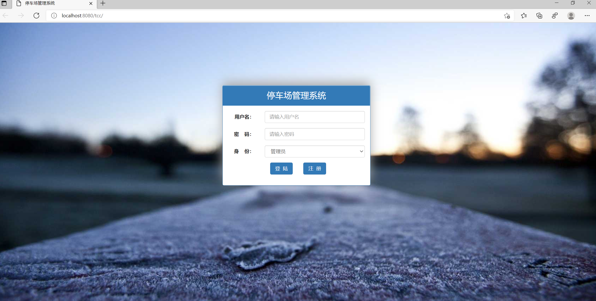
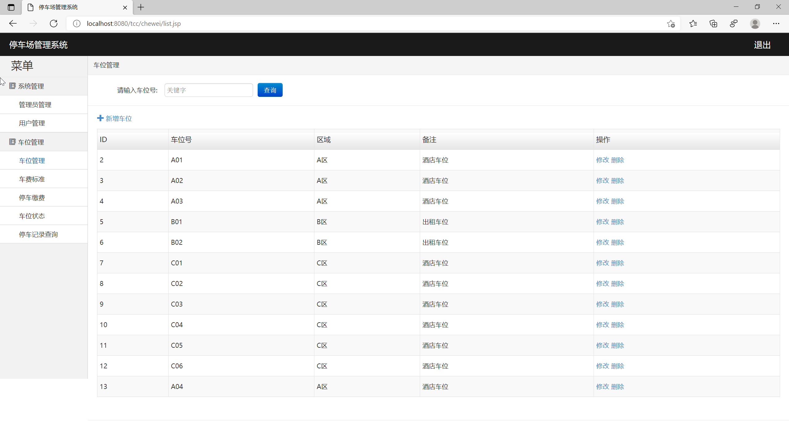
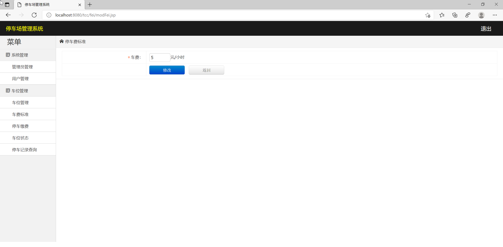
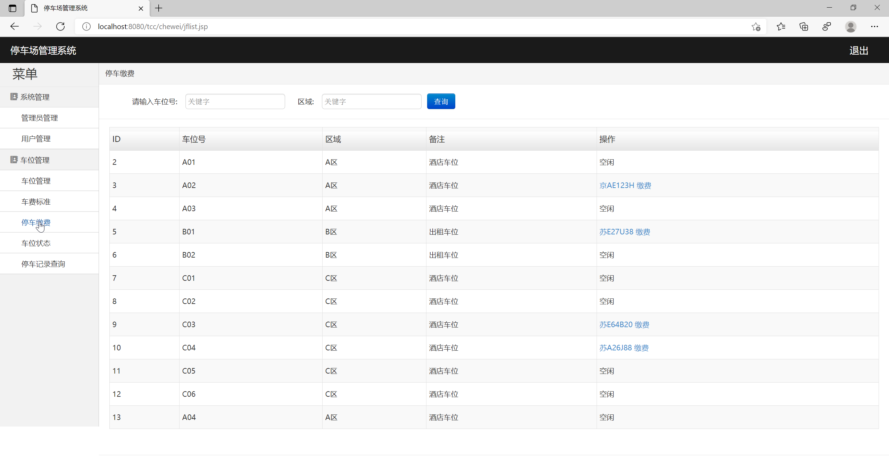
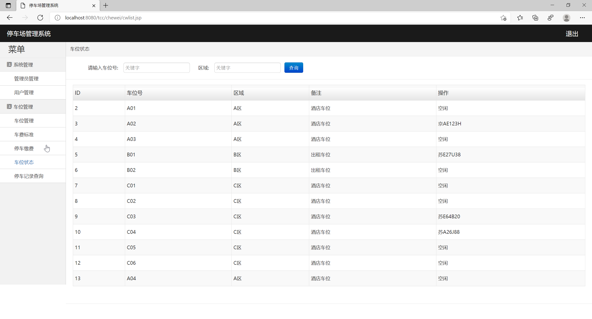
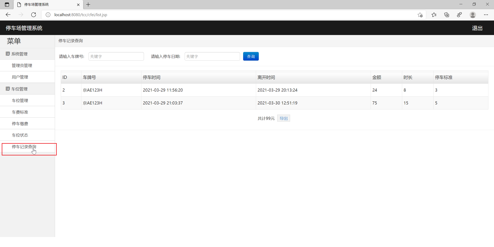
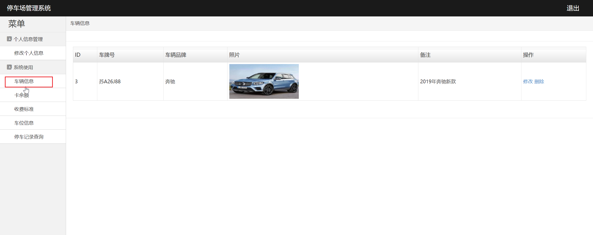
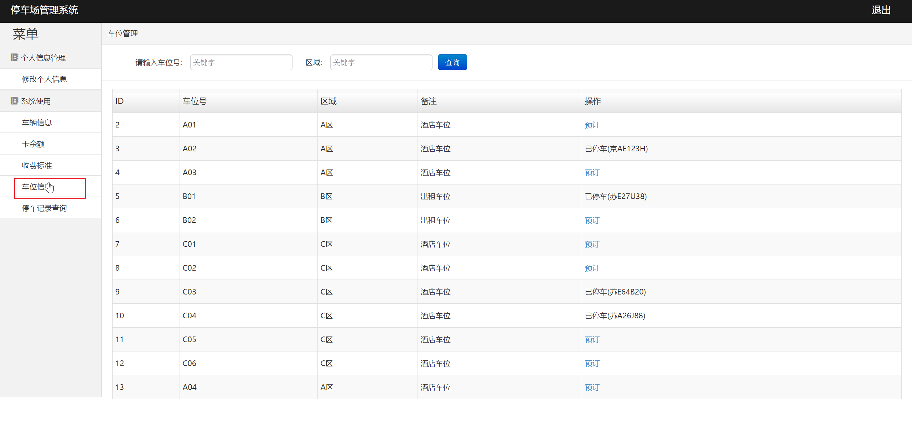

## 基于JavaWeb的停车场管理系统

###  获取sql数据库文件: 从戎源码网 (https://armycodes.com/) QQ: 386869957 QQ群: 377586148
###  所有系统地址: (https://github.com/YuLin-Coder/AllProjectCatalog) 
###  所有项目以及源代码本人均调试运行无问题 可支持远程安装部署调试、定制修改、代码讲解

## 项目介绍
基于JavaWeb的停车场管理系统，采用B/S结构，使用JAVA开发语言，结合JSP技术，以MySQL作为后台数据库。
该系统共包含两种角色：用户、管理员等，系统的功能模块包括：系统登陆、管理员管理、用户管理、车位管理、车费标准、停车缴费、车位状态、停车记录查询、修改个人信息、车辆信息、卡余额等功能。

## 项目技术
- 编程语言：Java
- 数据库：MySQL
- 前端技术：JSP、JavaScript、bootstrap、JQuery
- 后端技术：Servlet、JDBC

## 运行环境
- JDK版本：JDK1.8及以上
- 开发工具：IDEA、Ecplise、Myecplise都可以
- 数据库: MySQL5.7及以上

## 运行截图

